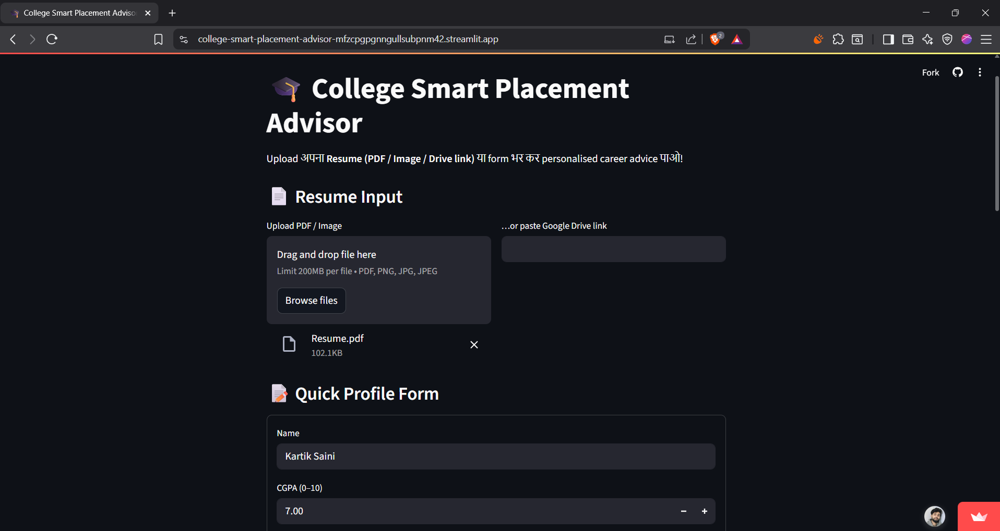
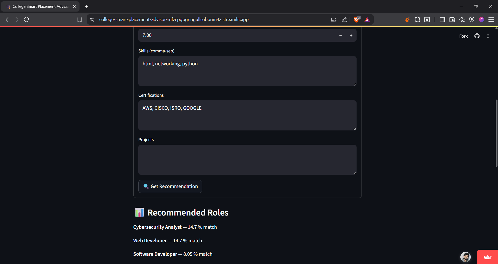
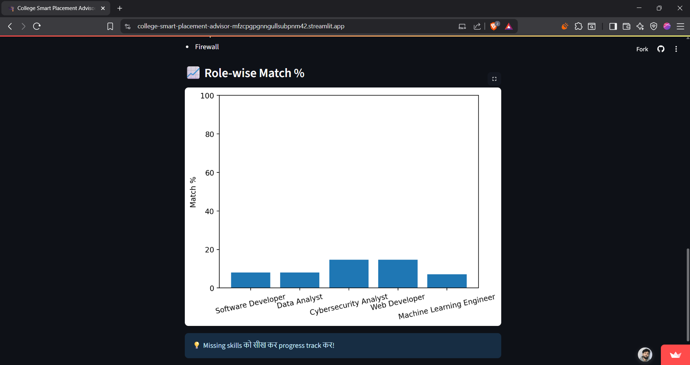
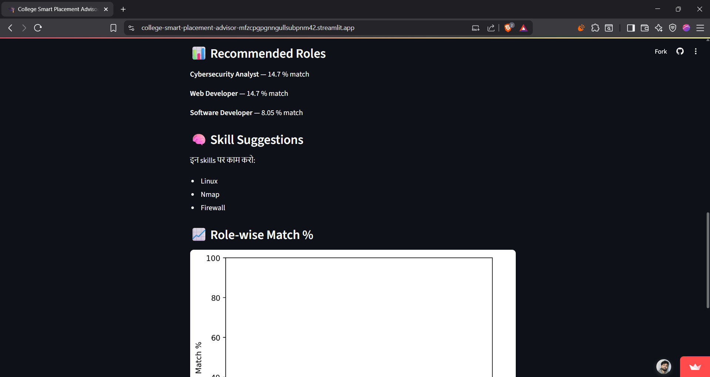

# 🎓 College Smart Placement Advisor

AI‑powered Streamlit app that analyzes your resume and gives you career role suggestions based on your skills, CGPA, and certifications — with skill-gap analysis!

[](https://college-smart-placement-advisor-mfzcpgpgnngullsubpnm42.streamlit.app/)

---

## ✨ Features

- 📄 Upload resume as PDF, image, or Google Drive link  
- 🧠 Extracts Name, CGPA, Skills, Certifications automatically  
- 🔍 Matches profile with predefined job-role skill matrix (TF-IDF similarity)  
- 📊 Shows role-wise match % and missing skills to learn  
- 🎯 Built for students to understand and improve their placement readiness  

---

## 🚀 Quick Start

```bash
git clone https://github.com/KartikSaini01/College-smart-placement-advisor.git
cd College-smart-placement-advisor
pip install -r requirements.txt
streamlit run app.py

```   


## 🛠️ Tech Stack

| Layer           | Libraries / Tools                            |
|-----------------|----------------------------------------------|
| App Framework   | **Streamlit**                                |
| NLP & ML        | **scikit-learn** (TF-IDF, Cosine Similarity) |
| PDF Parsing     | **PyMuPDF**                                  |
| Image OCR       | **pytesseract**                              |
| Data Handling   | **pandas**                                   |
| Visualization   | **matplotlib**                               |

## 📸 Demo Screenshots

| Step | Preview |
|------|---------|
| 📠Resume Upload + Profile Form | [](screens/upload.png) |
| 🧠 Job Recommendations | [](screens/recommend.png) |
| 📊 Match % & Graph | [](screens/chart.png) |
| 🧩 Skill Suggestions | [](screens/skills.png) |


## 📌 Sample Job Roles (CSV)

```csv
"Software Developer","python, java, git, oop"
"Data Analyst","python, sql, pandas, excel"
"ML Engineer","python, sklearn, numpy, pandas, ml"
"Cybersecurity Analyst","networking, linux, nmap, firewall"
"Web Developer","html, css, javascript, react"

```


## 📑 Future Enhancements

- **Admin Dashboard** for Training & Placement Cell to monitor aggregate skill gaps  
- **PDF Report Download** that attaches personalised recommendations to the student’s resume  
- **Learning Roadmap**: auto‑generated list of courses / YouTube playlists for missing skills  
- **Email Integration** to send results directly to students and T&P officers  
- **Role Templates Expansion**: add more job profiles such as DevOps Engineer, Cloud Architect, Product Manager  
- **Progress Tracker**: let users re‑upload updated resumes and visualise improvement over time  

---

## 🤝 Contributing

Pull requests are welcome! 🎯 
You can contribute by:

- Adding new job roles & skill mappings  
- Improving resume parsing logic  
- Enhancing UI/UX or fixing bugs  

To contribute:

1. Fork this repo  
2. Make your changes in a new branch  
3. Open a pull request 🚀

---

## 📬 Contact

Made with ❤️ by **Kartik Saini**  
📧 Email: [ks889005@gmail.com](mailto:ks889005@gmail.com)  
🔗 LinkedIn: [www.linkedin.com/in/kartik-saini-4821a3373](https://www.linkedin.com/in/kartik-saini-4821a3373)
